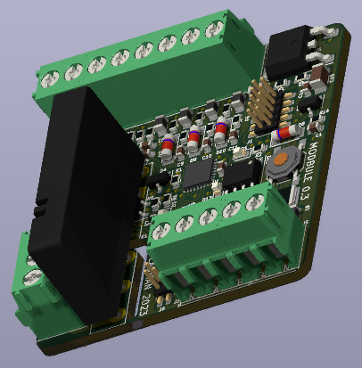
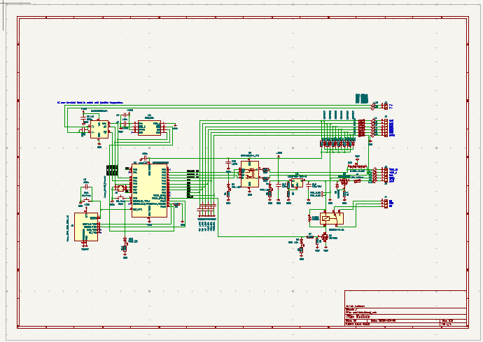

# Modbule hardware
Fully functional, reliable version of the PCB.

Drawn in KiCad (previous versions involved but imported to KiCad 8).

Now there are only previews. The full sources will be released after succesfull funding.
This project has to be considered non-commercial or sligtly-commercial if you don't agree with my definition of non-commercial.

It was not intended to make me rich but also not make me broke.

The development took considerable amount of money and time for a single developer.
I want to get back something of before everyone can copy my work, legaly or illegaly (as you do usualy at some parts of Asia specificaly).

The license will be kind of GPL, because I want see your modifications.

Multiple licensing is also possible if you are interrested in.

Don't hesitate to contact me.

